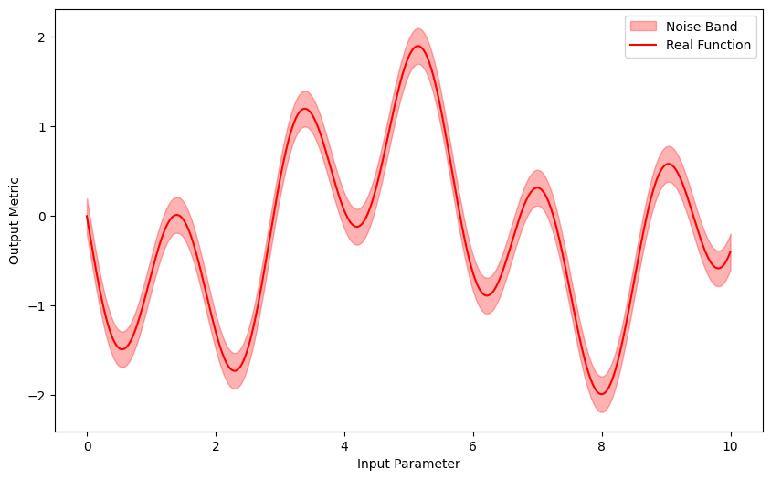
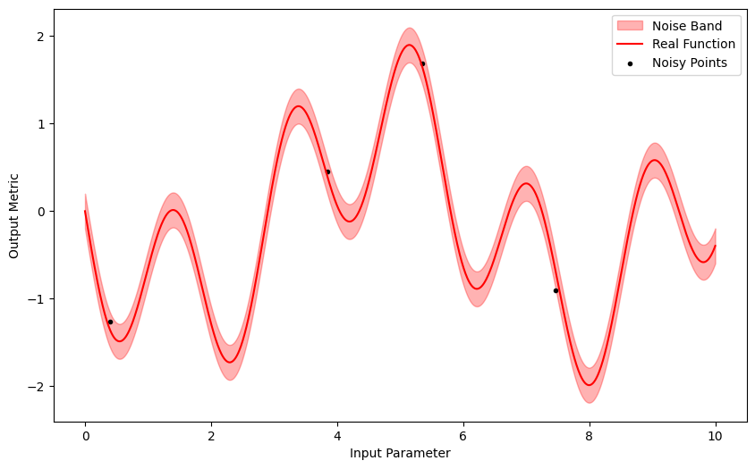
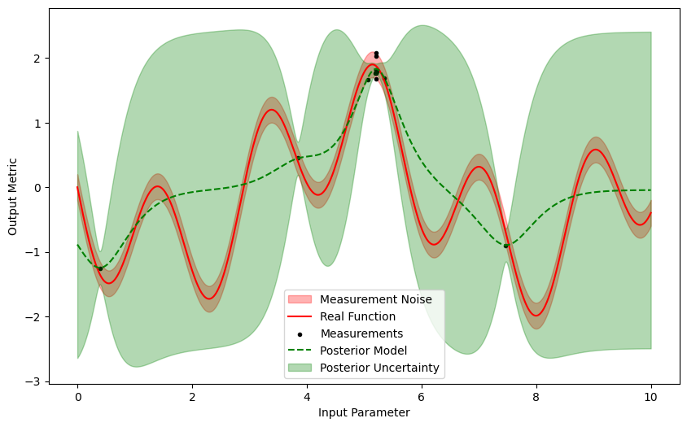

In the following, a Single-Input-Single-Output (SISO) function is optimized.

The function that we will be optimizing is:


$$ f(x) = -\left(\sin{\left(x\right)} + \sin{\left(\frac{10}{3} \cdot x\right)}\right),\,\, x \in [0, 10] $$

which is a maximization problem where the parameter $x$ has a range of 0 to 10, and the optimum point is at $x^* = 5.14574$ and $f(x^*) = 1.8996$.

### 1. Import the necessary packages
```python linenums="1"
import torch
import matplotlib.pyplot as plt

from odyssey.mission import Mission # Mission
from odyssey.objective import Objective # Objective
from odyssey.navigators import SingleGP_Navigator # Navigator
from odyssey.navigators.sampler_navigators import Sobol_Navigator # Initial Sampler
from odyssey.navigators import UpperConfidenceBound # Acquisition Function
```

### 2. Define the function and the objective
The function is defined, and a `noise_level` parameter is added to implement some measurement noise.
```python linenums="1"
def real_func(x: torch.Tensor, noise_level = 0):
    noise = (-1 + torch.rand(x.size()) * 2) * noise_level
    return -(torch.sin(x) + torch.sin((10.0 / 3.0) * x)) + noisew
```

### 3. Visualize the function

Now some ground truth data is created to see what the function looks like. This is done by creating 1000 points evenly distributed in the parameter space, without any noise.

```python linenums="1"
test_X = torch.linspace(0, 10, 1000)
test_Y = real_func(test_X, noise_level = 0)
```

For the purposes of the optimization, the `noise_level` parameter will be set to $0.2$, and the `real_func` function is wrapped by the `Objective` class to define the objective.

```python linenums="1"
noise_level = 0.2
objective = Objective(real_func, noise_level = noise_level)
```
Now, plot the real function, along with the noise band:

```python linenums="1"
plt.figure(figsize=(10, 6))

plt.fill_between(test_X, test_Y - noise_level, test_Y + noise_level, color='red', alpha=0.3, label='Noise Band')
plt.plot(test_X, test_Y, color='red', label='Real Function')

plt.xlabel('Input Parameter')
plt.ylabel('Output Metric')
plt.legend()
plt.show()
```
!!! note "Output"
    

### 4. Define the Mission

In this case, we have a Mission with one input dimension and one output dimension. The `param_space` for the single input variable is 0 to 10, and as this is a maximization function, the goal is to ascend.

```python linenums="1"
param_space = [(0.0, 10.0)]
goals = ['ascend']

mission = Mission(
    name = 'siso_test',
    funcs = [objective],
    maneuvers = goals,
    envelope = param_space
)
```

### 5. Define the navigator
We want to initialize the model with 4 initial points, defined by the `num_init_design` variable, and the `SingleGP_Navigator` well suited as the navigator, as this is a single objective problem. Additionally, the `UpperConfidenceBound` (UCB) acquisition function is used with the `beta` parameter set to $0.5$.
```python linenums="1"
num_init_design = 4

navigator = SingleGP_Navigator(
    mission = mission,
    num_init_design = num_init_design,
    input_scaling = False,
    data_standardization = False,
    init_method = Sobol_Navigator(mission = mission),
    acq_function_type = UpperConfidenceBound,
    acq_function_params = {'beta': 0.5}
)
```

### 6. Visualize the initial points
The points investigated so far are available in the `mission` object:
```python linenums="1"
print(mission.display_X)
print(mission.display_Y)
```
!!! note "Output"
    ```python
    >>> tensor([[0.3935],
            [3.8459],
            [5.3469],
            [7.4725]])
        tensor([[-1.2596],
                [ 0.4513],
                [ 1.6862],
                [-0.9045]])
    ```

A plot is now created with the initial points:

```python linenums="1"
plt.figure(figsize=(10, 6))

plt.fill_between(test_X, test_Y - noise_level, test_Y + noise_level, color='red', alpha=0.3, label='Noise Band')
plt.plot(test_X, test_Y, color='red', label='Real Function')
plt.scatter(mission.display_X, mission.display_Y, color = 'k', marker = '.', label='Noisy Points')

plt.xlabel('Input Parameter')
plt.ylabel('Output Metric')
plt.legend()
plt.show()
```

!!! note "Output"
    


### 7. Run the optimization loop
The `num_iter` variable defines the number of iterations to run, and is set to $10$. Some additional packages are imported here to filter out any warnings that might arise during the loop. The intermediate trajectories and observations are printed while the loop runs.

```python linenums="1"
num_iter = 10

from warnings import catch_warnings
from warnings import simplefilter

while len(mission.display_X) - num_init_design < num_iter:

    with catch_warnings() as w:
        simplefilter('ignore')
        
        trajectory = navigator.trajectory()
        observation = navigator.probe(trajectory, init = False)
        print(len(mission.display_X) - num_init_design, trajectory, observation)
        navigator.relay(trajectory, observation)
        navigator.upgrade()
```

<details>
<summary>Expand to see Output</summary>
```python
>>> 0 tensor([[5.2228]]) tensor([[1.7943]])
    Succesfully appended {'param_1': [5.222783697804586], 'objective_1': [1.7942542090001241], 'creation_timestamp': '07-06-24 20:42:18'} to missionlogs/siso_test-070624_204218.csv
    1 tensor([[5.0633]]) tensor([[1.6669]])
    Succesfully appended {'param_1': [5.063268220232772], 'objective_1': [1.6669435062813764], 'creation_timestamp': '07-06-24 20:42:18'} to missionlogs/siso_test-070624_204218.csv
    2 tensor([[5.2090]]) tensor([[2.0303]])
    Succesfully appended {'param_1': [5.209039917615592], 'objective_1': [2.030305338216286], 'creation_timestamp': '07-06-24 20:42:19'} to missionlogs/siso_test-070624_204218.csv
    3 tensor([[5.2030]]) tensor([[2.0740]])
    Succesfully appended {'param_1': [5.20300015093294], 'objective_1': [2.073958124226767], 'creation_timestamp': '07-06-24 20:42:19'} to missionlogs/siso_test-070624_204218.csv
    4 tensor([[5.1981]]) tensor([[1.7659]])
    Succesfully appended {'param_1': [5.198063877181482], 'objective_1': [1.7658530056055226], 'creation_timestamp': '07-06-24 20:42:19'} to missionlogs/siso_test-070624_204218.csv
    5 tensor([[5.2057]]) tensor([[1.8139]])
    Succesfully appended {'param_1': [5.205699318922052], 'objective_1': [1.813869009628372], 'creation_timestamp': '07-06-24 20:42:19'} to missionlogs/siso_test-070624_204218.csv
    6 tensor([[5.2067]]) tensor([[1.7615]])
    Succesfully appended {'param_1': [5.206695536261849], 'objective_1': [1.7615019525702753], 'creation_timestamp': '07-06-24 20:42:19'} to missionlogs/siso_test-070624_204218.csv
    7 tensor([[5.2078]]) tensor([[1.7921]])
    Succesfully appended {'param_1': [5.207809210199016], 'objective_1': [1.7920781084517736], 'creation_timestamp': '07-06-24 20:42:19'} to missionlogs/siso_test-070624_204218.csv
    8 tensor([[5.2079]]) tensor([[1.6780]])
    Succesfully appended {'param_1': [5.207949576707767], 'objective_1': [1.677978183918718], 'creation_timestamp': '07-06-24 20:42:19'} to missionlogs/siso_test-070624_204218.csv
    9 tensor([[5.2089]]) tensor([[1.8183]])
    Succesfully appended {'param_1': [5.20894024902588], 'objective_1': [1.8183155492649645], 'creation_timestamp': '07-06-24 20:42:19'} to missionlogs/siso_test-070624_204218.csv
```
</details>

### 8. Visualize the iterated points and uncertainty

To find the uncertainty, the posterior mean and standard deviation need to be found. These can be calculated using the `model` attribute of the `navigator` object. The posterior model is always set up for a maximization, so if you have a minimization problem, simply add a minus (-) before the `pred_mean`.

```python linenums="1"
model = navigator.model
pred_mean = model.posterior(test_X).mean.detach().squeeze()
pred_std = torch.sqrt(model.posterior(test_X).variance).detach().squeeze()
```

Now a plot can be generated with the function, noise band, iterated points, posterior model and uncertainty:
```python linenums="1"
fig, ax = plt.subplots(figsize=(10, 6))

# Real function and noise band
ax.fill_between(test_X, test_Y - noise_level, test_Y + noise_level, color='red', alpha=0.3, label='Measurement Noise')
ax.plot(test_X, test_Y, color='red', label='Real Function')

# Measurements
ax.scatter(mission.display_X, mission.display_Y, color = 'k', marker = '.', label='Measurements')

# Posterior model and uncertainty
ax.plot(test_X.squeeze(), pred_mean, color = 'g', linestyle = 'dashed', label = 'Posterior Model')
ax.fill_between(test_X.squeeze(), pred_mean - 2*pred_std, pred_mean + 2*pred_std, color  ='g', alpha = 0.3, label = 'Posterior Uncertainty')

ax.set_xlabel('Input Parameter')
ax.set_ylabel('Output Metric')
ax.legend()

plt.show()
```

!!! note "Output"
    

Notice how the posterior model has a better mean and lower uncertainty around the observed points!

### 9. Analyze the results
The results can be analyzed by finding the iterated point with the highest output value, as this is a maximization problem:

```python linenums="1"
best_idx = mission.display_Y.argmax().item()
best_input = mission.display_X[best_idx].item()
best_output = mission.display_Y[best_idx].item()

print(f'Best Input: {best_input}')
print(f'Best Output: {best_output}')
```

!!! note "Output"
    ```python
    >>> Best Input: 5.20300015093294
        Best Output: 2.073958124226767
    ```

Looking at the final plot, it does seem that the best observed point is right on the upper limit of the noise band - this explains the slightly higher optimal value. Nonetheless, with just 4 random iterations and 10 optimization iterations, we have come fairly close to the optimum point.


